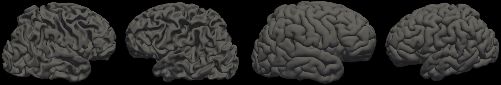

# FetalSurfaceExtraction


## Table of contents

* [Overview](#overview)
* [Dataset](#dataset)
* [Installation](#installation)
* [Training](#training)
* [Evaluation](#evaluation)
* [Performance](#performance)

## Overview  
This project focuses on the application of the CoTAN (Conditional Temporal Attention Network) for the reconstruction of fetal cortical surfaces using the dHCP dataset. It includes a brain age prediction model with ResNet architecture. 

## Dataset

The estimated brain age model was trained with 200 MRI selected from the dHCP neonatal dataset betwen 27 GW and 39 GW. 

The surface extraction model was trained with the dHCP neonatal dataset that includes over 800 MRI scans. Once downloaded, the T2 weighted MRI should be affinely aligned to the MNI-152 space. A template is provided in  ```FetalSurfaceExtraction/template/mni152_brain_clip.nii.gz ``` . 

You can download the data [here]. (https://biomedia.github.io/dHCP-release-notes/download.html). 

For the following commands, we assume that the dataset has the following structure: 
``` bash
/FetalSurfaceExtraction
    /data
        /sub-CC00050XX01_ses-7201
            /sub-CC00050XX01_ses-7201_left_white.surf.gii
            /sub-CC00050XX01_ses-7201_left_pial.surf.gii
            /sub-CC00050XX01_ses-7201_right_white.surf.gii
            /sub-CC00050XX01_ses-7201_right_pial.surf.gii
        /sub-CC00051XX02_ses-7702
            /...
        /...
    /combined.csv
```
where ``` combined.csv ``` is the metadata containing the scan age of the subjects that can be downloaded here
## Installation

First you need to clone this repository by following the next commands:
``` bash
git clone https://github.com/marisol-lemus/FetalSurfaceExtraction.git
``` 
The dependencies can installed by running the following code: 
``` bash
python -m venv FetalSurfaceExtraction_env
source FetalSurfaceExtraction_env/bin/activate
pip install -r code/requirements.txt
```
## Training
To train the brain age model run the following command

``` bash
python FetalSurfaceExtraction/code/brain_age_training.py\         
                -train_csv='FetalSurfaceExtraction/data/data_training.csv'\
                -val_csv='FetalSurfaceExtraction/data/data_validation.csv'\
                -out_csv='/FetalSurfaceExtraction/training/'\
                -rl='FetalSurfaceExtraction/training/'\
                -wl='FetalSurfaceExtraction/training/'\
                -hl='FetalSurfaceExtraction/training/'\
                -learning_rate=0.001\
                -slice_mode=0\
                -batch_size=32\
                --epoch=200\
                -n_slices=5
```

Where ``` train_csv ``` and ``` val_csv ``` are the csv files for training and validation respectly, it includes the subject ID, GW and path, you can see an example in ``` FetalSurfaceExtraction/training/ ```Please refer to ``` FetalSurfaceExtraction/config_GA.py ``` for detailed configurations. 

To train the surface extraction model first you need to aligned the T2 to the MNI-152 space. Please run:
``` bash
python FetalSurfaceExtraction/code/register.py --path='FetalSurfaceExtraction/data/ 
```
Where ``` bash data_path``` is the directory of your dataset. 

Then, train the model running the following command:
``` bash
python FetalSurfaceExtraction/code/surface_extraction_train.py --data_path='FetalSurfaceExtraction/data/'\
                --model_path='FetalSurfaceExtraction/model/'\
                --surf_type='white'\
                --surf_hemi='left'\
                --data_name='dhcp'\
                --tag='EXP_ID'\
                --step_size=0.02\
                --n_epoch=200\
                --device='cuda:0'
```
where ``` data_path ```  is the directory of the dataset, ``` model_path ``` is the directory to save the log and checkpoints of training, ``` surf_type ``` is the type of the surface (wm, pial), ``` surf_hemi ``` is the brain hemisphere (right, left). Please refer to ``` FetalSurfaceExtraction/codes/config_surfaces.py``` for detailed configurations.

## Evaluation

For the inference, please run: 
``` bash
python FetalSurfaceExtraction/code/pred.py --data_path='/YOUR_T2_MRI.nii.gz'\
               --save_path='/YOUR_RESULT_PATH/'\
```
where data_path is the file name of your T2w brain MRI. The predicted surfaces will be saved to your ``` save_path ``` in GIfTI format ``` .surf.gii. ```

For visualization of the surfaces, we recommend to use Freesurfer, which visualizes the predicted cortical surfaces as follows. 


## Performance 
Brain Age Prediction Model:
* validation mae = 0.6785
* validation loss = 0.34
 
Surface Extraction Model:
* 0.12±0.03mm geometric error
* 0.07±0.03% selfintersecting faces


